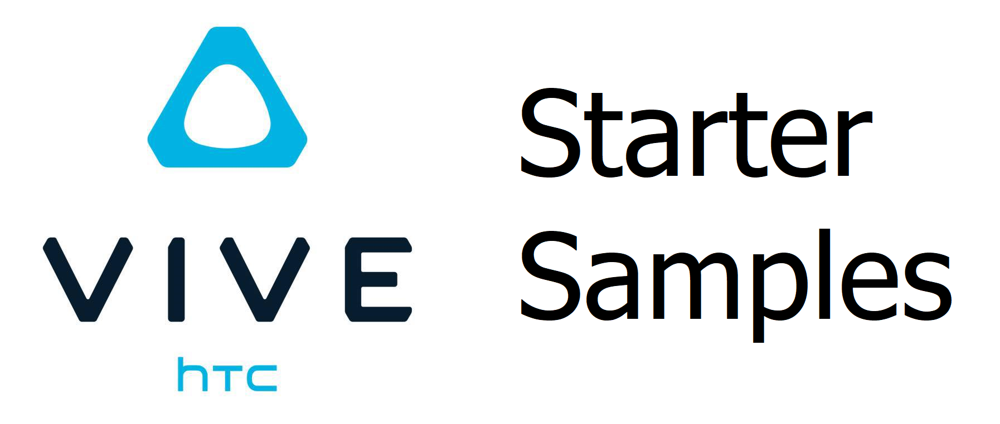

# VIVE OpenXR Starter Samples

The start samples here depend on [VIVE OpenXR Unity Plugin](https://developer.vive.com/resources/openxr/unity/) and will inspire you on how to use the features.

The [HTC License](./LICENSE) applies to the samples.

This project was built using the [Unity 2021.3.3f1](https://unity.com/download).

## Get Code

Clone this repo using the "Code" button above, or below commands:

- Using SSH
```sh
git clone git@github.com:ViveSoftware/VIVE-OpenXR-Sample-Unity.git
```

- Using HTTPS
```sh
git clone https://github.com/ViveSoftware/VIVE-OpenXR-Sample-Unity.git
```

## Run in Unity

1. Make sure you're using **Unity 2021.3.3f1** or newer.
2. Switch to the **Android** or **Windows** platform in **Build Settings**.
3. Click on *VIVE* > *OpenXR Installer* > *Install or Update latest version* from the menu bar to import the **VIVE OpenXR Unity Plugin**.
4. Navigate to *Project Settings* > *XR Plug-in Management* > *OpenXR* platform settings, select **VIVE XR Support** and enable features you need.

## Test on Android Device

1. Navigate to *VIVE* > *Build Starter Samples* to build an APK.
2. Navigate to the `VIVE-OpenXR-Sample-Unity` folder and use **adb** to install the APK.

## Optional Dependencies

- We use the [VRM](https://github.com/vrm-c/UniVRM/releases) packages for the avatar development.

## Integrate Samples to your own project
1. Make sure your project uses the same SDK version
2. Move the samples to your project
   <details>
      <summary><b>Copy Samples directory</b></summary>

      + Copy [Assets/ViveOpenXRStarterSamples](./Assets/ViveOpenXRStarterSamples) directory to your own project
    </details>
    <details>
      <summary><b>Create and Import UnityPackage</b></summary>

      1. Open VIVE-OpenXR-Sample-Unity project in Unity
      2. Right-click on [Assets/ViveOpenXRStarterSamples](./Assets/ViveOpenXRStarterSamples) and select <i>Export Package...</i>
      3. Save package in an easy location to retrieve
      4. Open your own project (where you want the samples to be added)
      5. Click on <i>Assets > Import Package > Custom Package...</i> from the menu bar
      6. Find the package we saved in step 3 and click <i>Open</i>
    </details>